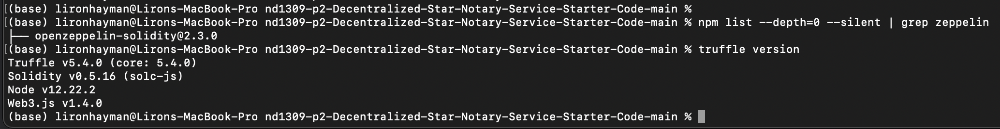

# ND1309 C2 Ethereum Smart Contracts, Tokens and Dapps - Project Starter 
**PROJECT: Decentralized Star Notary Service Project** - For this project, you will create a DApp by adding functionality with your smart contract and deploy it on the public testnet.

### Versions Used

Truffle v5.4.0
Open-Zeppelin 2.3.0

### ERC-721 token details 

Name: Liron2
Symbol: LDI
ID: 123

Token address on Rinkeyby: https://rinkeby.etherscan.io/token/0x0d2b3cbe0df12c7b757e10a66ee9dbac7771ccca?a=123
Transaction: https://rinkeby.etherscan.io/tx/0x7fc63467b0ca49315f3bada75e0fb626615f71fd0ece8a95e5b2bc3cac892677 
